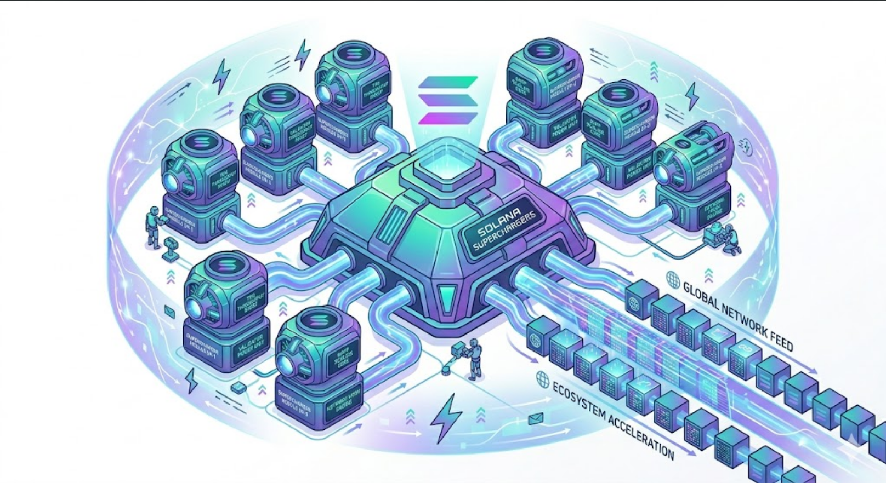

<div align="center">



# solana-superchargers

**Production-grade Claude Code / Codex skills for Solana builders.**

A curated set of skills that fill unclaimed gaps in the
[Solana AI Kit](https://github.com/solanabr/solana-ai-kit) ecosystem. Every
skill is self-contained, MIT-licensed, and verified against real code.

[](./SKILLS.md)
[](./LICENSE)
[](#install)
[](https://claude.ai/code)
[](https://openai.com/codex)

</div>

---

## Install the most popular skill

The most popular entry point — `solana-indexer` — installs in one command:

```bash
curl -fsSL https://raw.githubusercontent.com/srivtx/solana-superchargers/main/solana-indexer-skill/install.sh | bash
```

That copies the skill into `~/.claude/skills/solana-indexer/` (and
`~/.codex/skills/solana-indexer/` if Codex is detected). Restart Claude
Code or Codex to pick it up.

> **Other skills in this repo** (each has its own one-liner at
> `https://raw.githubusercontent.com/srivtx/solana-superchargers/main/<skill>/install.sh`):
>
> | Skill | Curated link |
> |---|---|
> | `solana-indexer` | `…/solana-indexer-skill/install.sh \| bash` |
> | _(more coming)_ | _(see [`SKILLS.md`](./SKILLS.md))_ |

## Install everything (or pick a subset)

The repo is a multi-skill marketplace. The top-level installer knows about
every skill via `SKILLS.md`:

```bash
# Clone once
git clone https://github.com/srivtx/solana-superchargers.git
cd solana-superchargers

# Install everything
./install.sh add all

# Or pick a subset
./install.sh add solana-indexer
./install.sh add preset:core
./install.sh add category:indexers

# Or just download the manager without cloning
curl -fsSL https://raw.githubusercontent.com/srivtx/solana-superchargers/main/install.sh | bash -s -- add solana-indexer
```

## Commands

| Command | What it does |
|---|---|
| `add <skill\|category:<name>\|preset:<name>\|all> [...]` | Install skills, categories, or presets |
| `remove <skill> [...]` | Uninstall one or more skills |
| `remove --all` | Uninstall every supercharger-installed skill |
| `list` | Show all skills with install status |
| `categories` | Show all categories |
| `presets` | Show all preset bundles |
| `info <skill\|preset>` | Show details for one target |
| `verify` | Check installed skills are valid |
| `help` | Show usage |

## Repository layout

```
solana-superchargers/
├── install.sh              # multi-skill installer (add/remove/list/verify/presets)
├── SKILLS.md               # marketplace index (parsed by install.sh)
├── CONTRIBUTING.md         # how to add a new skill
├── CHANGELOG.md            # version history
├── LICENSE                 # MIT
├── assets/                 # logos
│   └── supercharger.png
├── .github/workflows/      # CI: validate every skill on every push
│   └── validate.yml
└── solana-<name>-skill/    # one subdirectory per skill
    ├── CLAUDE.md
    ├── README.md
    ├── install.sh         # per-skill one-liner (delegates to ../install.sh)
    ├── skill/             # SKILL.md + references/ + examples/
    ├── agents/            # specialized agents
    ├── commands/          # slash commands
    └── rules/             # auto-loading rules
```

## Why a multi-skill repo

Most Solana skills share the same primitives — they reference the same
MCPs (`ext/helius`, `ext/sendai/...`), they build on the same `solana-dev`
foundation, they need the same testing setup. A multi-skill repo gives you:

- **Shared installer** — one `install.sh` knows about every skill
- **Coordinated releases** — when Solana tooling changes (new RPC
  provider, new SDK version), update once, benefit everywhere
- **Cross-skill patterns** — patterns from one skill (e.g., slot-conditional
  upserts, dedup via `(slot, signature)`) apply to others
- **Single `SKILLS.md` index** — discoverable from one place

Each skill is still a self-contained directory that you can install
independently. The repo structure doesn't change the per-skill contract.

## Adding a new skill

See [`CONTRIBUTING.md`](./CONTRIBUTING.md) for the full checklist. Short
version:

1. Create a subdirectory: `mkdir solana-foo-skill`
2. Add `skill/SKILL.md` with the required frontmatter (`name`, `description`)
3. Add `references/`, `examples/`, `agents/`, `commands/`, `rules/` as needed
4. Add a `LICENSE` (MIT) and `install.sh`
5. Add an entry under the right category in `SKILLS.md` — this is what the installer reads
6. Open a PR. CI runs `install.sh verify` on every skill.

## License

[MIT](./LICENSE)

---

<sub>Built by [@srivtx](https://github.com/srivtx) · A Superteam Earn
submission · Used as a reference for the Solana AI Kit ecosystem</sub>
