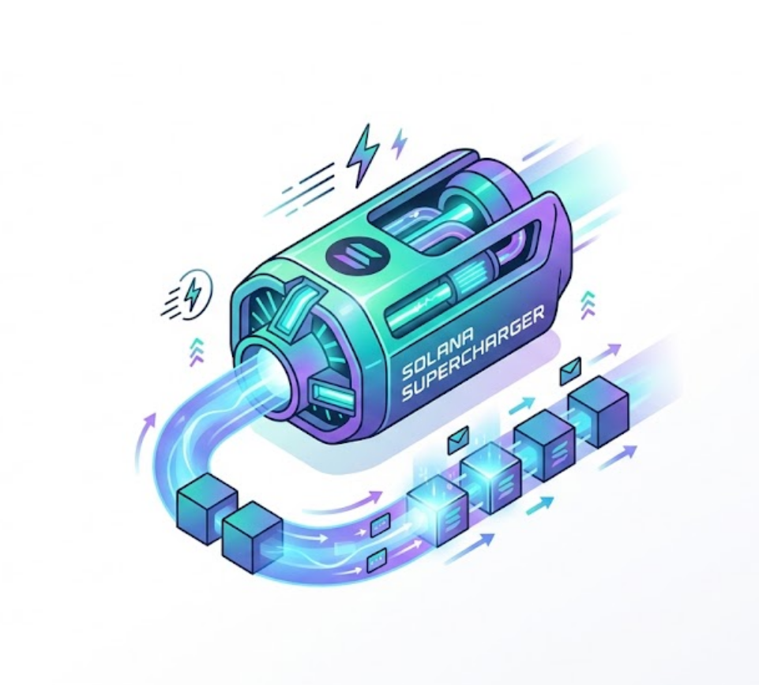

<div align="center">



# solana-superchargers

**Production-grade Claude Code / Codex skills for Solana builders.**

A curated set of skills that fill unclaimed gaps in the
[Solana AI Kit](https://github.com/solanabr/solana-ai-kit) ecosystem. Every
skill is self-contained, MIT-licensed, and verified against real code.

[](./SKILLS.md)
[](./SKILLS.md)
[](./LICENSE)
[](#install)
[](https://claude.ai/code)
[](https://openai.com/codex)

[Install](#install) · [Skills](./SKILLS.md) · [Contributing](./CONTRIBUTING.md) · [Changelog](./CHANGELOG.md)

</div>

---

## What this is

A **multi-skill repo** for the Solana AI Kit. Each subdirectory is one
self-contained skill that drops into `~/.claude/skills/` and
`~/.codex/skills/`. Skills follow the
[agent-skills spec](https://agentskills.io/) — frontmatter + progressive
loading + `install.sh` per skill.

The Solana AI Kit ecosystem has hundreds of skills. Most categories (DeFi,
security, mobile) are saturated. **The gaps are narrower, deeper problems.**
This repo hosts a curated set of skills that fill those gaps with
production-grade quality.

## Install

```bash
git clone https://github.com/srivtx/solana-superchargers.git
cd solana-superchargers

# One skill
./install.sh add solana-indexer

# All current skills
./install.sh add all

# A preset bundle
./install.sh add preset:core

# See what's available
./install.sh list
./install.sh presets
./install.sh categories

# Verify
./install.sh verify
```

The installer copies each skill to `~/.claude/skills/<name>/` and mirrors to
`~/.codex/skills/<name>/` if Codex is detected. Existing installs are
overwritten. Restart Claude Code or Codex to pick up the skills.

### Environment variables

| Variable | Default | Purpose |
|---|---|---|
| `CLAUDE_SKILLS_HOME` | `~/.claude/skills` | Where skills install |
| `CODEX_SKILLS_HOME` | `~/.codex/skills` | Where skills mirror for codex |
| `SUPERCHARGER_BRANCH` | `main` | Which git ref (when pulling the installer) |

## Commands

| Command | What it does |
|---|---|
| `add <skill\|category:<name>\|preset:<name>\|all> [...]` | Install skills, categories, or presets |
| `remove <skill> [...]` | Uninstall one or more skills |
| `remove --all` | Uninstall every supercharger-installed skill |
| `list` | Show all skills with install status |
| `categories` | Show all categories |
| `presets` | Show all preset bundles |
| `info <skill\|preset>` | Show details for one target |
| `verify` | Check installed skills are valid |
| `help` | Show usage |

`add` resolves in order: **preset → category → skill**. Most specific match wins.

## Current skills

| Skill | Status | Description |
|---|---|---|
| [`solana-indexer`](./solana-indexer-skill) | v0.1 | Build custom Solana indexers: Geyser plugins, backfill strategies, Postgres schemas, real-time streaming, cost optimization, production ops. 9 references, 3 working examples, 2 agents, 2 commands, 1 rule. |

See [`SKILLS.md`](./SKILLS.md) for the full roadmap of upcoming skills (DeFi, Token-2022, Security, Observability, MEV, dApp UX, Testing, Mobile, GTM, Infrastructure, Compliance, AI Agents).

## Repository layout

```
solana-superchargers/
├── install.sh              # multi-skill installer (add/remove/list/verify/presets)
├── README.md               # this file
├── SKILLS.md               # marketplace index (parsed by install.sh)
├── CHANGELOG.md            # version history
├── CONTRIBUTING.md         # how to add a new skill
├── LICENSE                 # MIT
├── assets/                 # logos, banners
│   └── supercharger.png
├── .github/
│   └── workflows/          # CI: validate every skill on every PR
└── solana-indexer-skill/   # first skill
    ├── CLAUDE.md
    ├── README.md
    ├── LICENSE
    ├── TODO.md
    ├── install.sh          # per-skill installer
    ├── skill/
    │   ├── SKILL.md
    │   ├── references/     # 9 progressive-loading .md files
    │   └── examples/        # 3 working code examples
    ├── agents/             # 2 specialized agents
    ├── commands/           # 2 slash commands
    └── rules/              # 1 auto-loading rule
```

## Adding a new skill

See [`CONTRIBUTING.md`](./CONTRIBUTING.md) for the full checklist. Short version:

1. Create a subdirectory: `mkdir solana-foo-skill`
2. Add `skill/SKILL.md` with the required frontmatter (`name`, `description`)
3. Add `references/`, `examples/`, `agents/`, `commands/`, `rules/` as needed
4. Add a `LICENSE` (MIT) and `install.sh`
5. Add an entry under the right category in `SKILLS.md` — this is what the installer reads
6. Open a PR. CI runs `install.sh verify` on every skill.

## Roadmap

| Skill | Status | Target |
|---|---|---|
| `solana-indexer` | ✅ v0.1 | Shipped |
| `solana-defi` | planned | After Superteam Earn bounty acceptance |
| `solana-token2022` | planned | — |
| `solana-observability` | planned | — |
| `solana-mev` | planned | — |
| `solana-dapp-ux` | planned | — |
| `solana-e2e` | planned | — |
| `solana-mobile-ux` | planned | — |
| `solana-gtm` | planned | — |
| `solana-infra` | planned | — |
| `solana-security` | planned | — |
| `solana-compliance` | planned | — |
| `solana-agent` | planned | — |

See [`solana-indexer-skill/TODO.md`](./solana-indexer-skill/TODO.md) for
detailed milestones.

## Why a multi-skill repo (not one-repo-per-skill)?

Most Solana skills are tightly related — they share Solana primitives,
they reference the same MCPs (`ext/helius`, `ext/sendai/...`), they
build on the same `solana-dev` foundation. A multi-skill repo gives you:

- **Shared installer** — one `install.sh` knows about every skill
- **Coordinated releases** — when Solana tooling changes (new RPC
  provider, new SDK version), update once, benefit everywhere
- **Cross-skill patterns** — patterns from `solana-indexer` (e.g., dedup
  via `(slot, signature)`, slot-conditional upserts) apply to
  `solana-observability` and `solana-agent` too
- **Single `SKILLS.md` index** — discoverable from one place

Each skill is still a self-contained directory that you can install
independently. The repo structure doesn't change the per-skill contract.

## License

[MIT](./LICENSE)

---

<sub>Built by [@srivtx](https://github.com/srivtx) · A Superteam Earn
submission · Used as a reference for the Solana AI Kit ecosystem</sub>
